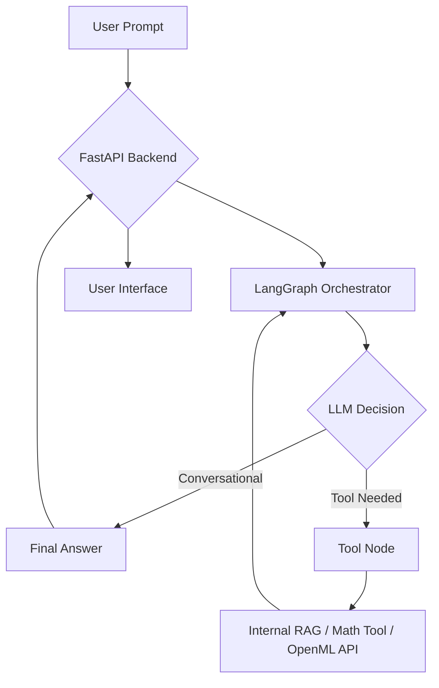

# Agentic AI POC: Autonomous Enterprise MLOps Assistant

An advanced Proof of Concept (POC) demonstrating an autonomous agentic workflow using LangGraph, RAG (Retrieval-Augmented Generation), and real-world tool orchestration.

## 🚨 Problem Statement
Traditional AI chatbots often follow static decision trees or lack the ability to interact with external systems and internal documentation dynamically. Enterprise users need a system that can:
1.  **Reason** about complex multi-step queries (e.g., retrieving a policy and then performing math on that data).
2.  **Integrate** with live external APIs (like OpenML) and internal vector databases seamlessly.
3.  **Ensure Resilience** by operating in a local/offline mode when API keys are restricted or quotas are met.

## 🎯 Objective
To build a modular, production-ready Agentic AI system that validates tool-calling capabilities, provides an interactive modern UI, and implements a multi-provider LLM routing layer for high availability.

## 🏗️ Solution Architecture
The system is built on a **State-Graph Architecture** using LangGraph.

-   **State Machine**: Manages the conversation flow and determines when to transition between "Agent" (Reasoning) and "Tools" (Action) nodes.
-   **Provider Router**: A dynamic middleware layer that selects the best LLM (OpenAI, Gemini, or OpenRouter) based on available `.env` credentials.
-   **Knowledge Base**: Localized ChromaDB vector store for grounding responses in enterprise policies.
-   **Toolbelt**: A suite of Python-based functions that the agent can "hand-off" tasks to.

## 🛠️ Tools & Languages Used
-   **Core Language**: Python 3.12
-   **Agentic Framework**: LangGraph + LangChain
-   **Backend**: FastAPI (Python)
-   **Vector DB**: ChromaDB + HuggingFace Embeddings
-   **External Integration**: OpenML API
-   **Frontend**: Vanilla HTML5, CSS3 (Glassmorphism), and Javascript ES6
-   **Deployment**: Docker & Docker-Compose

## 🔄 Request Flow


## 🚀 How to Run

### 1. Simple Virtual Environment
```bash
# Clone and navigate
cd agentic_poc

# Initialize Environment
python3 -m venv venv
source venv/bin/activate
pip install -r requirements.txt

# Launch Server
uvicorn app.main:app --reload
```

### 2. Docker (Production Standard)
```bash
docker-compose up --build
```
Access the application at: **`http://localhost:8000`**

### 📦 Environment Configuration
Rename or create a `.env` file in the root:
```env
OPENAI_API_KEY="sk-..."
GOOGLE_API_KEY="AIza..."
OPENROUTER_API_KEY="sk-or-v...""
```
*Note: If no keys are provided, the app enters **Mock Mode** for safe demonstration.*

## ⚠️ Limitations
-   **Provider Rate Limits**: The POC is subject to the quotas of the provided API keys (Gemini Flash/OpenAI 3.5).
-   **Mock Depth**: While in "Mock Mode," the agent relies on keyword matching to simulate tool calls; it does not perform deep semantic reasoning without a valid API key.
-   **RAG Scope**: The current vector store indexes a static `data/sample_doc.txt`; real production would require a dynamic ingestion pipeline.
